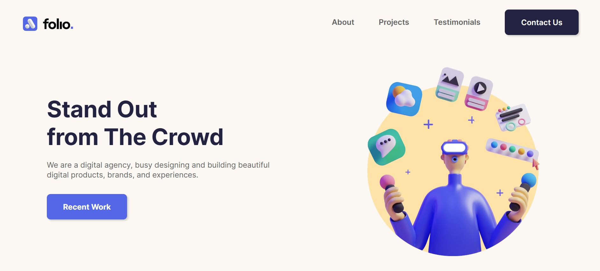

- [Overview](#overview)
  - [Screenshot](#screenshot)
  - [Links](#links)
- [My process](#my-process)
  - [Built with](#built-with)
  - [What I learned](#what-i-learned)

### Overview

This is my first portfolio project for a fictional digital agency. The focus of this project was to practice responsive web design. 

I have used responsible images with different resolutions for mobile and desktop versions as well as created media queries for mobile, tablet, and desktop (mobile-first approach). 

The projects section includes a responsive grid that is changing its layout depending on the screen width. I have also created a responsive sticky navbar with a hamburger menu for the smaller devices.

### Screenshot

### Links

- Live Site URL: [https://thunderous-clafoutis-080abe.netlify.app/]

## My process

### Built with

- Semantic HTML5 markup
- CSS custom properties
- Flexbox
- CSS Grid
- Mobile-first workflow
- JavaScript

### What I learned

I have learned about HTML forms, CSS Media queries, Flexbox and Grid, transform properties, such as translate, rotate and scale, and JavaScript Intersection Observer API for the sticky navbar.

### Continued development

I will be practicing to feel more confident with HTML forms, responsibility, spacing elements and transform properties in CSS, as well as JavaScript functions.

